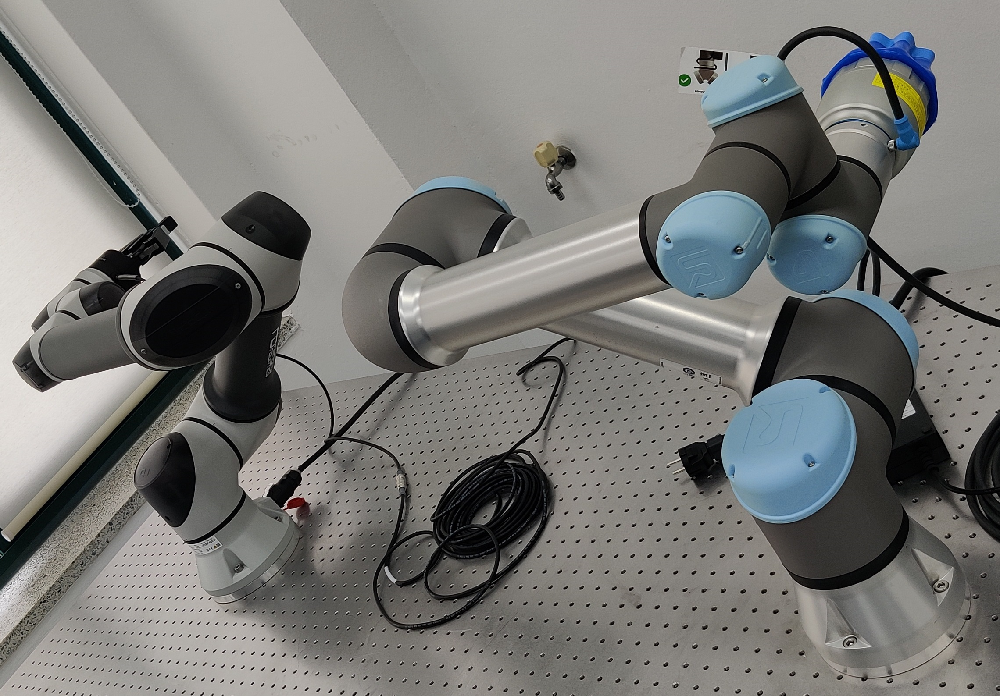

# Robotics Manipulator
This is a repo contains vaious works and algorithms that I tested, implemented and will implement for Robotics Manipulator. [For Mom!]

## References
Some of the code is taken from some of other repo (all right belong to their respective author). 
- [Python for Robotic (Repo)](https://github.com/AtsushiSakai/PythonRobotics)
- [Robotic Modeling and Control (Book)](http://sharif.edu/~namvar/index_files/Spong.pdf)
- Neural Network for Inverse Kinematic
	- [Repo 1](https://github.com/Utkarsh-Vats-2000/Inverse-Kinematics-using-Neural-Networks)
	- [Repo 2](https://github.com/paramrajpura/Neural-Networks-for-Inverse-Kinematics)